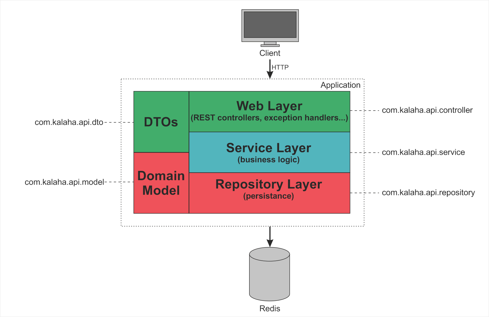
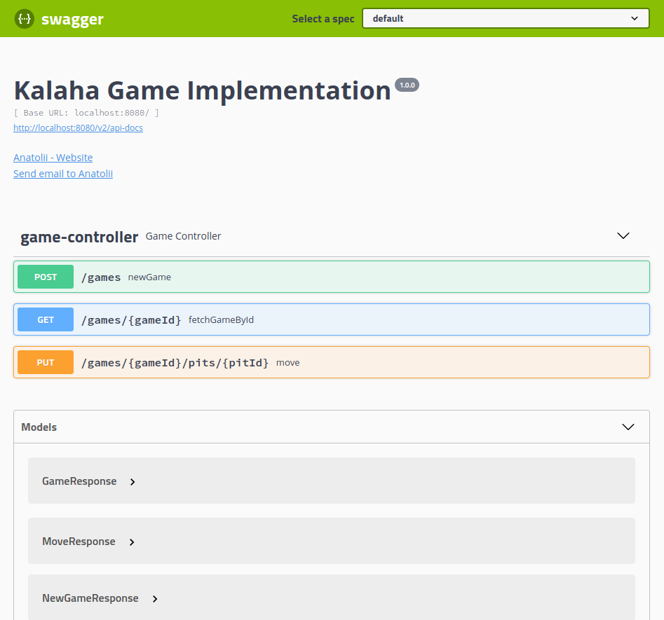

# kalaha-api


A simple Kalaha Game Implementation.

## Features

### Game API 

- Create game
- Make game move
- View game status

## Notes

The API designed as a REST APIs with JSON payload. 
To achieve fast reads and writes game state stored in the in-memory data store - Redis. 
In addition to that Redis gives a lot of flexibility in how to persist state to the disk.
Optimistic concurrency model applied when player updates the game state (see: [GameRedisRepository.java#L62](./src/main/java/com/kalaha/api/repository/GameRedisRepository.java#L62))
Such solution helps to avoid situations in concurrent environment, when one player can override game state updated by another player.

Mission critical pieces of application covered with tests.



Player's move outcomes:
- If sowing ends in the player own Kalaha she can move again
- If sowing ends in an own empty pit, all stones in the opposite pit (on the opponent's side) 
with the last stone of the sowing placed into player's Kalaha and turn is over
- If sowing ends on the opponent's side or in a nonempty pit on your own side, player's turn is over
- If all pits on player side become empty, the opponent captures own remaining stones and game is over

## Tools, Frameworks, Libraries

- Java 11+
- [Gradle](https://gradle.org/) build-automation tool
- [Docker](https://docs.docker.com/get-docker/) tool to containerize application
- [Docker Compose](https://docs.docker.com/compose/) tool to run multi-container docker applications
- [Spring Boot](https://spring.io/projects/spring-boot) framework to create micro-service
- [Testcontainers](https://www.testcontainers.org/) tool to automate test environment configuration
- [Swagger UI](https://swagger.io/tools/swagger-ui/) library for REST APIs documentation

## How to run the demo

- Clone the project from GitHub: `git clone git@github.com:volkodava/kalaha-api.git`

- Run application within multi-container environment: `make run`

## REST API Examples

- To create new game:

```bash
curl -X POST "http://localhost:8080/games" -H  "accept: application/json"
```

- To request game status:

```bash
curl -X GET "http://localhost:8080/games/50eab06e-2459-4480-acb5-1b09e845073f" -H  "accept: application/json"
```

- To perform move from pit `1` in game with id `50eab06e-2459-4480-acb5-1b09e845073f`:

```bash
curl -X PUT "http://localhost:8080/games/50eab06e-2459-4480-acb5-1b09e845073f/pits/1" -H  "accept: application/json"
```

## CI builds

Link: https://github.com/volkodava/kalaha-api/actions

## API Documentation

API documentation available after application starts at `http://localhost:${PORT}/swagger-ui`.



## Project Structure

- the code of solution ([src/main/java/com/kalaha/api](./src/main/java/com/kalaha/api)):
```
├── config                                  (Application configuration)
│   └── ...
├── controller                              (REST API)
│   ├── handler                             (REST API handlers)
│   │   └── ...
│   └── ...
├── core
│   ├── GameValidator.java                  (Game state validator)
│   └── KalahaEngine.java                   (Game engine)
├── dto                                     (DTOs)
│   └── ...
├── exception                               (Application exceptions)
│   └── ...
├── MainApplication.java                    (Application entrypoint)
├── model                                   (Business model)
│   └── ...
├── repository                              (Data persistence logic)
│   └── ...
└── service
    └── ...                                 (Business logic)
```

- tests ([src/test/java/com/kalaha/api/](./src/test/java/com/kalaha/api/)):
```
├── BaseItTests.java                    (Base integration test class)
├── controller
│   └── GameControllerItTests.java      (Game REST API integration tests)
└── core
    └── KalahaEngineTests.java          (Game engine unit tests)
```
